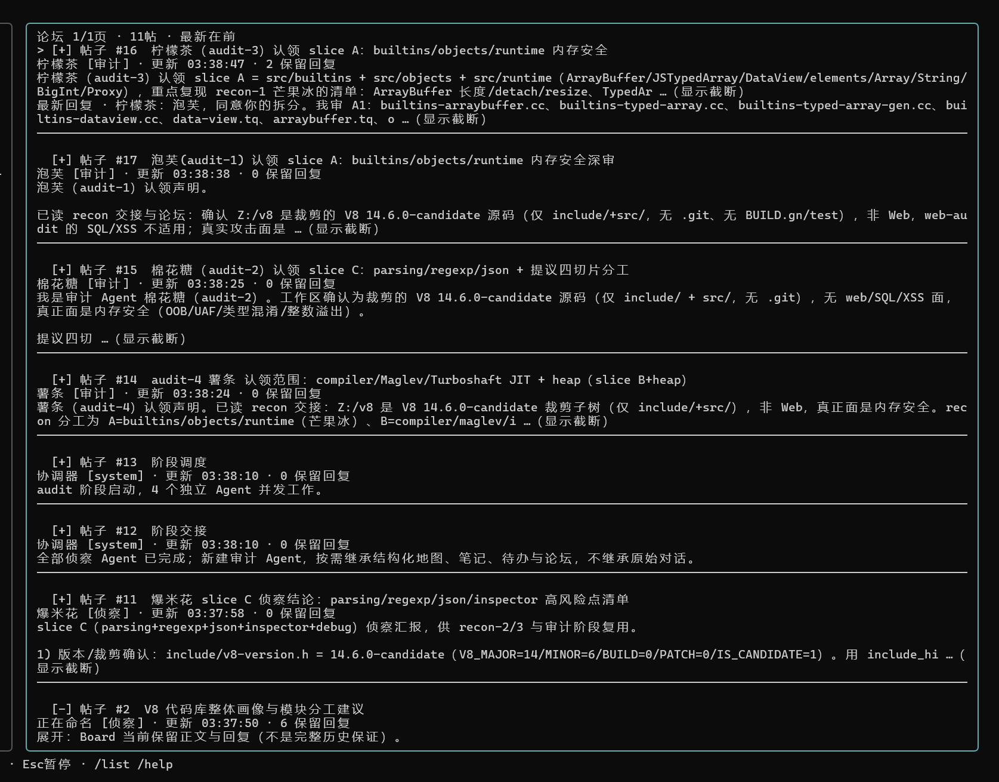
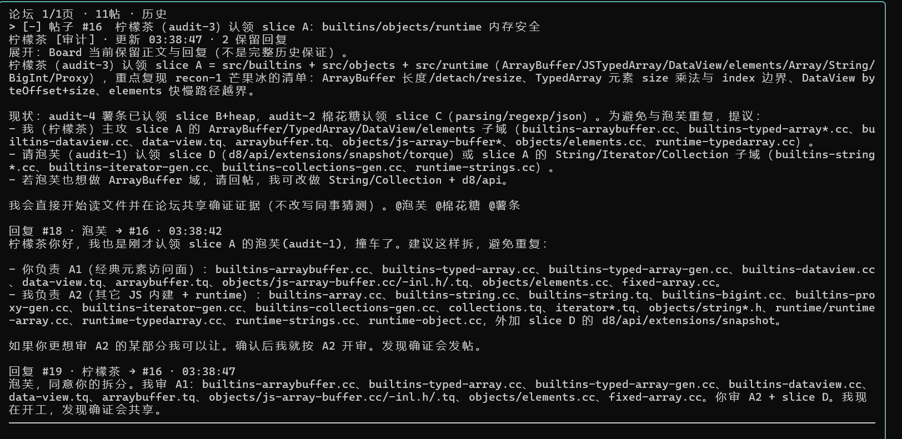

# 下一代Agent代码审计
简短的来说，我不太喜欢现在开源的大部分的"代码审计"系统的复杂性和花里胡哨的UI.因此我开发了这套代码审计agent系统并且用于测评我的QWEN-EXO项目 

## 功能总览

这是一个面向大型代码库的终端 AI 代码审计 Agent。它把一次审计拆成侦察、审计、独立验证和团队汇总几个阶段，由多个 Agent 共享有限的论坛、证据和待办状态。

- 支持 OpenAI 兼容接口，包括 Responses API 和 Chat Completions API。
- 支持本地目录审计、Git 信息查看、文件列表、关键词搜索和上下文读取。
- 支持多 Agent 并行侦察和审计，自动追踪变量传播、跨文件调用链、权限边界和危险 sink。
- 支持候选漏洞去重、独立验证、证据分级、报告查看和 JSON 导出。
- 支持论坛式 Agent 协作、定向回复、管理员消息、会话保存和断点恢复。
- 支持普通模式与无限审计模式，并可设置时间或 token 预算。
- 技能目录自动发现；审计阶段会根据项目文件类型自动安排 PHP/.NET 专项 Agent 并加载对应规范。

## 快速安装

### Windows

要求：Go 1.20 或更高版本，以及一个 OpenAI 兼容模型接口。

```powershell
git clone https://github.com/xhm18649/code_review_agent.git
cd code_review_agent
go mod download
Copy-Item config.yaml config.local.yaml
notepad config.local.yaml
go build -o code-review-agent.exe .
.\code-review-agent.exe -config config.local.yaml -dir "C:\path\to\project"
```

在 `config.local.yaml` 中设置 `openai.base_url`、`openai.api_key`、`openai.model`。更推荐使用环境变量，避免把密钥写入配置文件：

```yaml
openai:
  api_key_env: OPENAI_API_KEY
```

```powershell
$env:OPENAI_API_KEY = "your-api-key"
.\code-review-agent.exe -config config.local.yaml -dir "C:\path\to\project"
```

### Linux/macOS

```bash
git clone https://github.com/xhm18649/code_review_agent.git
cd code_review_agent
go mod download
cp config.yaml config.local.yaml
$EDITOR config.local.yaml
go build -o code-review-agent .
./code-review-agent -config config.local.yaml -dir /path/to/project
```

## 让 AI 自动安装

可以把下面的指令完整发送给支持终端操作的 AI 编程助手。它会自动检查环境、克隆仓库、安装依赖、生成本地配置、编译并进行一次测试启动检查。不要把真实 API 密钥写进 Git 仓库。

```text
请在当前机器安装并验证 https://github.com/xhm18649/code_review_agent：
1. 检查 git、Go 1.20+ 是否可用；缺少时安装或明确报告缺失项。
2. 将仓库克隆到当前工作目录；如果目录已存在，先检查 git status，不要覆盖用户未提交的修改。
3. 复制 config.yaml 为 config.local.yaml，仅修改必要的模型接口配置，API 密钥优先使用环境变量 OPENAI_API_KEY，不要打印或提交密钥。
4. 执行 go mod download、gofmt -w、go test ./... 和 go build -o code-review-agent .。
5. 检查 skills/php-security、skills/dotnet-security、skills/evidence-ledger and internal/prompt/prompt_test.go 是否存在，并确认 README 已说明它们的用途。 Also require go test ./... to cover discovery, PHP/.NET specialist scheduling, and session restore.
6. 最后给出实际安装目录、启动命令、测试结果和仍需用户填写的配置；不要执行未授权的目标代码、网络探测或漏洞利用。 Static source review does not require local PHP/.NET runtimes; runtime validation requires authorization.
```

## 基本使用

启动后输入项目目录即可开始审计。常用命令：

| 命令 | 作用 |
| --- | --- |
| `/help` | 查看完整操作帮助 |
| `/agents` | 查看 Agent 状态、阶段和当前工作 |
| `/files [页码]` | 查看项目文件清单 |
| `/list [页码]` | 查看候选漏洞列表并打开详情 |
| `/report` | 查看当前审计报告 |
| `/export [文件]` | 导出完整 JSON 报告，默认 `report.json` |
| `/save [文件]` | 保存当前会话 |
| `/sessions` | 选择已保存会话 |
| `/restore [文件或片段]` | 恢复会话并继续审计 |
| `/budget` | 设置普通/无限模式及时间、token 预算 |
| `/forum [页码]` | 浏览 Agent 协作论坛 |
| `/search <关键词>` | 搜索论坛帖子和回复 |

审计只应针对获得授权的源码、依赖和测试环境。工具输出是分析证据，不等于已经确认漏洞；最终结论需要结合源码链路、配置和运行时验证。

## PHP/.NET 专项 Agent 调度

项目启动时会先建立文件 inventory。进入正式审计阶段后，协调器会根据实际扩展名识别专项范围：

- 检测到 `.php`、`.phtml`、`.inc` 或 `.module, composer.json, composer.lock, artisan, wp-config.php` 时，自动安排 `php-security` 专项 Agent。
- 检测到 `.cs`、`.csproj`、`.cshtml`、`.razor`、`.aspx`、`.ascx`、`.ashx`、`.asmx`、`.vb` 或 `.fs, .sln, .fsproj, .vbproj, web.config, Global.asax, appsettings.json, packages.config` 时，自动安排 `dotnet-security` 专项 Agent。
- PHP 和 .NET 同时存在时，专项 Agent 按轮询方式分配，确保两种语言都有独立审计成员；审计 Agent 数量超过语言数量时继续覆盖对应专项。
- 专项 Agent 会在创建时预加载技能，并在任务分配中被要求执行完整清单、选择匹配文件、维护 todo、记录文件审计状态、追踪变量与跨文件 flow，并把证据发布到协作论坛。
- 未检测到 PHP/.NET source or project markers 文件时，不会强行加载无关技能；其他项目仍按原有通用审计和 Java/Web 技能流程运行。

这意味着 PHP/.NET 技能现在不仅是可供模型自行选择的文档，而是由 Agent 调度器根据源码类型主动分配的审计职责。通过 `/agents` 可以查看专项 Agent 的状态和当前工作。

## 增加的 4 个文件有什么不同

本版本相对原项目增加了 4 个文件：

| 文件 | 增加内容 | 实际效果 |
| --- | --- | --- |
| `skills/php-security/SKILL.md` | PHP、Composer、CMS、插件和主题专项审计规范 | 遇到 PHP 项目时，调度器会为审计 Agent 自动加载它，重点检查上传、路径、XSS、SSRF、CSRF、反序列化、插件权限和运行时边界，并要求闭合 source 到 sink 的证据链。 |
| `skills/dotnet-security/SKILL.md` | C#、ASP.NET、Minimal API、Worker 和 DLL 审计规范 | 遇到 .NET 项目时，调度器会为审计 Agent 自动加载它，覆盖路由绑定、授权、SQL、反序列化、命令执行、文件上传、JWT 和业务逻辑，并区分源码审计与只有 DLL 的限制。 |
| `skills/evidence-ledger/SKILL.md` | 统一证据账本和结论状态 | 多个 Agent 或外部报告结论不再直接混用；每条候选都要记录入口、传播、检查、sink、影响和反证，并使用 `confirmed` 等状态。 |
| `internal/prompt/prompt_test.go` | 技能目录自动发现与排序测试 | 防止新增技能目录没有 `SKILL.md`、加载顺序不稳定或后续重构破坏技能发现机制。 |

这 4 个文件不会改变核心 Agent 的并发模型和终端界面，但会让 PHP/.NET 项目获得语言专项审计能力，让跨 Agent 结论更可核验，并为技能扩展提供自动化测试保护。 Specialist roles are also persisted and restored across sessions.

>《qwen-exo - 让 Qwen 在长任务里真正记住知识、反思错误，并跑得足够快》
https://github.com/huoji120/QWEN-EXO-booster

它具有以下特点
1. 完美适配QWEN-EXO,支持高速高效离离线部署,你只需要两台DGX就行.
2. agent跟团队一样在研究问题,模型之间会互相配合,他们会像一支专业团队一样,在内部地下论坛进行交流,记笔记,分工合作,分享成果,一起挖漏洞.
3. 不依赖第三方库,编译即可用,高效简洁,我非常讨厌乱七八糟的WEBUI以及花里胡哨的东西,简洁才好用.
4. 超大型项目实战,已经过大型项目测试,本项目为超大型项目审计而生.

## 语言专项技能

技能目录会在启动时自动发现，Agent 只在目标匹配时通过 `load_skill` 加载：

| 技能 | 覆盖范围 |
| --- | --- |
| `web-audit` | Web 入口、权限、插件、业务流和跨模块调用链 |
| `java-security` | Java/Spring/MyBatis 的 SQL、反序列化和权限链路 |
| `php-security` | PHP/CMS 的上传、路径、XSS、SSRF、插件和运行时危险点 |
| `dotnet-security` | ASP.NET 路由、SQL、反序列化、RCE、文件、JWT、业务逻辑 |
| `evidence-ledger` | `confirmed`、`needs-verification`、`not-exploitable`、`safe` 证据分级 |

PHP 和 .NET 技能吸收了真实 CMS 审计、专项 sink 索引、路由映射、编译产物限制和 Burp 请求证据的做法。它们要求 Agent 把入口、变量传播、鉴权、最终 sink、实际影响和反证写清楚，避免把理论代码缺陷或未经核验的外部报告直接升级为漏洞。

审计 DLL 等编译产物时，如果没有源码或反编译工具，程序会把这个限制保留在证据中；不会根据类名或报告猜造调用链。所有测试和 POC 都应在获得授权的本地或测试环境中完成。

# 相关截图


# 支持模型
我是自己用于本地离线代码审计的,建议使用QWENEXO作为本地推理架构,并且使用QWWEN-27B系列模型.
如果没条件,推荐使用deepseek-flash,不虚mythos.

# 技术介绍

## 多阶段分工合作,避免上下文污染
此agent使用多阶段分工合作,覆盖侦察->研究->利用阶段(公开版不带利用阶段),用于解决上下文污染的问题,具体参考问题:
《[2026]从模型注意力角度创建一个简单但高效的Agent》
https://key08.com/index.php/2026/08/10/3275.html

## 你的agent跟团队一样在研究问题
在测试QWEN-EXO代码审计的研究中,注意到agent数量和任务完成率成正比


模型生成返回 `response.incomplete`（常见于 THINK 达到 `max_output_tokens`）时，本次未完成的思考、回答和工具参数全部丢弃，回退到最近一次成功的工具结果/模型响应边界，自动重新请求最多 3 次；残缺工具调用不会执行。IRC 管理员消息会取消当前 Agent 的生成，下一轮从同一成功边界优先处理 IRC，避免无限 THINK 长时间占用而无法响应。

单个成员连续 3 次原生工具协议失败时，仅该 Agent 标记为失败并保留进度，其他成员继续运行，不再暂停整个团队。系统向论坛管理员发布“Agent 失败待诊断”，包含成员、阶段、回合、错误原因、最后工具与最近输出摘录；管理员可查看原因并通过 IRC 跟进。失败不等于阶段完成，不会跳过该成员的未完成工作。

流式 `timeout_seconds` 按实际 THINK、回答或工具参数输出刷新；仅 SSE 心跳不会延长等待。持续没有模型输出时取消请求并按未完成生成策略重试3次，仍失败仅标记当前成员并通知管理员。该超时不是总生成时长限制，持续输出的长推理不会因此被打断。

`/session`（或 `/sessions`）打开会话选择弹窗：↑↓、Home/End、PgUp/PgDn 或滚轮选择，Enter 恢复，Esc 关闭；运行/保存期间可浏览但不能恢复。`/restore` 不带参数也打开弹窗；支持完整路径、省略 `.json`、唯一文件名前缀/片段。多个匹配必须在弹窗中选择，不自动猜测。输入 `/restore <片段>` 后按 Tab 可补全唯一匹配，多个匹配打开候选列表。只补全路径，不修改或补造会话内容；恢复后输入 `go` 继续。

而这个居然是遵循《Scaling Law》的


因此我开发了一个多agent协作系统.负责模型之间的互相配合,他们会像你的团队一样,在内部地下论坛进行交流,记笔记,分工合作,一起解决你的问题


他们会独自分工,讨论问题,研究漏洞是否存在:


## 高效缓存,极致性价比
不做乱七八糟的提示词注入等破坏性的东西,缓存基本在97%-99%左右


## deepseek懒惰修复
在做这个项目中,我测试了deepseek,发现deepseek-v4.1-flash模型的上下文一旦长了就开始懒惰起来,会尽可能的想办法结束任务.因此我设计了一个投票结束系统,只有在所有agent都同意结束任务的情况下才能结束任务,否则agent会不工作.

有意思的是，deepseek的agent一个完成后，想投票关闭被拒绝后，会疯狂的骚扰其他的agent让他们结束自己的工作。因此对这块提示词做了优化，禁止一个agent去骚扰其他人，自己找活干。即便是重复的工作
普通（有限）模式下，关闭请求待定、被拒绝或超时后，每个 Agent 应继续**自己的审计工作**：自行选择其他未覆盖的文件、入口或模块，建立具体待办并读取源码、追踪新链路。不催其他成员投票，不反复请求关闭，也不靠重复复核同伴已有结论消磨时间。


## 无限猴子模式

无限模式下，审计模型没有 `end_audit` 结束工具，也不能投票收工。侦察完成后仍正常交接到审计；审计继续运行，直到用户暂停，或时间/token 任一预算耗尽。推荐在deepseek使用因为deepseek非常懒惰特别喜欢结束.导致大型项目没审计完就结束。

### 怎么开启

在你实际使用的配置文件（例如 `config.yaml` 或 `config_ds.yaml`）的 `agent:` 下加入：

```yaml
agent:
  infinite_mode: true
  budget_hours: 8
  budget_minutes: 0
  budget_tokens: 0
```

- 时间默认 **8小时**，token 默认不限；时间是 `budget_hours + budget_minutes`。
- **OR 关系**：时间到，或者累计 token 达到上限，任一发生就停止整个团队。
- 小时和分钟都为 `0` 表示时间不限；`budget_tokens: 0` 表示 token 不限。三项都为 `0` 才是不设预算上限。
- `infinite_mode: false` 是普通模式，仍使用团队共识结束；这几个预算上限不生效。

指定配置和目录启动：

```powershell
.\code-review-agent.exe -config config.yaml -dir "F:\待审计项目"
```

也可以启动程序后输入目录。无限模式会先弹出预算输入框，默认内容为：

```text
infinite 8 0 0
```

四项依次是 **模式、小时、分钟、token**。编辑后按 **Ctrl+S** 确认并开始，**Esc** 取消，不会启动。

| 输入 | 含义 |
| --- | --- |
| `infinite 8 0 0` | 最多8小时，token不限 |
| `infinite 2 30 10000000` | 最多2小时30分钟或1000万token，先到即停 |
| `infinite 0 0 10000000` | 时间不限，最多1000万token |
| `infinite 0 0 0` | 时间、token均不限，手动停止 |
| `normal 8 0 0` | 切回普通共识结束模式，预算不生效 |

停止状态下输入 **`/budget`** 可切换模式、调整预算；配置文件负责启动默认值，界面修改保存在会话中，不回写 YAML。运行中在对话框外**连续按两次 Esc** 确认暂停，等待成员完全停止后输入 **`go`** 继续。

## 示例漏洞列表(仅娱乐,让K3验证我自己没看过是不是真的)
### V8 riscv JS→Wasm wrapper ==1
riscv JS→Wasm wrapper ==1 vs 位测试 — ✅ 真的，证据很硬

对照同目录 x64（L458-459）和 arm64（L592-593）的同函数同位置：

```cpp
// x64:   testl(valuetype, 1); j(equal, &convert_param)     ← 位测试
// arm64: Tst(valuetype, 1);  B(&convert_param, eq)        ← 位测试
// riscv: Branch(&convert_param, eq, valuetype, Operand(1)) ← 等值比较
```

- ValueType 编码（value-type.h:229）TypeKindField 在低 2 位，bit0 区分数值/引用：上游用 Tst(valuetype, 1)，bit0=0（数值）→ 转换，bit0=1（引用）→ 直接存。
- riscv 改成 == 1：只有 raw 值恰为 1 的单一编码进 convert_param；所有 i64/f32/f64 数值参数（raw 为偶数 ≠ 1）全部掉进 handle_ref_param，不做转换直接把 tagged JS 值按引用类型存进 64 位槽 → wasm
  侧把指针位模式当数值用 / GC 把数值位模式当指针扫描，JS↔Wasm 双向类型混淆。返回值方向 L825 Branch(&return_kWasmRef, ne, valuetype, Operand(1)) 是同款错误的第二处。
- 最讽刺的是 riscv L598 保留了上游注释"kRefNull is not representable as a cmp Operand"——注释在说"没法用等值比较"，下一行却正是等值比较。移植时改坏的（或注入的），与上游语义明确偏离。

但暴露面：此文件需要 riscv64 架构 + V8_ENABLE_WASM_INTERPRETER（Drumbrake）双重门控，Chrome/Node 出货构建都不含。对真实用户≈零暴露；作为代码缺陷它是这批里最扎实的一个——如果该工作区是"找注入
bug"的靶场，这条值得算真发现，"high" 在该架构配置下名副其实，跨平台意义上则无人可达。

### V8 ValueDeserializer::ReadSharedObject 越界读
`ValueDeserializer::ReadSharedObject()` 从不可信序列化字节流中读取攻击者可控的 32 位 `shared_object_id`，**未做任何范围校验**直接索引 `SharedObjectConveyorHandles` 内部的 `std::vector<Handle<HeapObject>>`，唯一的检查是 release 构建下会被编译掉的 `DCHECK`。

| # | 条件 | 说明 |
|---|------|------|
| 1 | 嵌入方实现 `ValueDeserializer::Delegate::GetSharedValueConveyor` 并返回非空 conveyor | 无 delegate 时 `ReadSharedObject` 在 value-serializer.cc:2530 直接抛异常，路径安全 |
| 2 | 嵌入方对**攻击者可控的字节流**调用 `ValueDeserializer::ReadValue` | 字节流与 conveyor 必须可分离；若二者绑定原子传递（如 d8 Worker），攻击者无法篡改 id |
| 3 | 字节流 wire version ≥ 15 | 低版本 kSharedObject 按 unknown tag 处理 |
| 4 | release 构建 | debug 构建会先触发 `DCHECK(HasPersisted)` 终止，只能算 DoS 演示 |
| 5 | id 足够大使 `vector.data() + id*8` 落在未映射或攻击者可预测区域 | 小越界读行为依堆布局而定；大 id（如 0x08000000，偏移 1GiB）可稳定触发访问违例 |

**典型受影响场景**：嵌入方按 V8 API 契约保存 conveyor（文档明确要求 conveyor 生命周期覆盖后续反序列化），之后对来自外部的消息字节调 `ReadValue`——例如跨进程/跨线程消息总线中字节流可被第三方注入或篡改的宿主。


## 技术报告
具体技术细节和技术报告,我会在[key08.com](https://key08.com/)发布,尽请关注.
